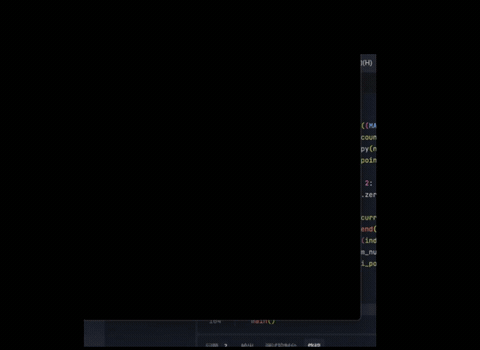

# Bezier-Curve: 贝塞尔曲线绘制与光栅化实验
## 202411081056 徐子晴 计算机科学与技术
本项目为图形学实验——贝塞尔曲线的几何理解与 De Casteljau 算法的 GPU 实现。基于 Taichi 语言，利用 GPU 并行计算实时渲染任意控制点下的贝塞尔曲线，并提供交互式 GUI 窗口，支持鼠标添加控制点、绘制控制多边形，以及键盘一键清屏。

## 目录

- [项目概述](#项目概述)
- [项目架构](#项目架构)
- [代码逻辑](#代码逻辑)
  - [初始化与缓冲区](#初始化与缓冲区)
  - [De Casteljau 算法](#de-casteljau-算法)
  - [GPU 绘制内核](#gpu-绘制内核)
  - [主循环与交互逻辑](#主循环与交互逻辑)
- [实现功能](#实现功能)
- [效果展示](#效果展示)

## 项目概述

**Bezier-Curve** 是一个图形学基础实验项目，旨在理解贝塞尔曲线的几何意义、掌握 De Casteljau 递归求值算法，以及学习如何在像素缓冲区（Frame Buffer）中直接操作像素（光栅化）。程序使用 Python + Taichi 实现，用户通过鼠标点击放置控制点，GPU 实时计算曲线并渲染到 800×800 的窗口中，同时显示控制多边形。

## 项目架构

本项目采用单文件实现，所有逻辑集成在 `main.py` 中，结构清晰，便于阅读与快速上手：

```
Bezier-Curve/
├── README.md
└── main.py               # 全部核心代码：配置、算法、GPU 内核、GUI 交互
```

## 代码逻辑

### 初始化与缓冲区

- 使用 `ti.init(arch=ti.gpu)` 启用 GPU 后端。
- 定义屏幕尺寸 `WIDTH=800`, `HEIGHT=800`，最大控制点数 `MAX_CONTROL_POINTS=100`，曲线采样数 `NUM_SEGMENTS=1000`。
- 分配三大 GPU 缓冲区（`ti.Vector.field`）：
  - `pixels`：尺寸 `(800, 800)`，存储每个像素的 RGB 颜色，最终显示到画布。
  - `gui_points`：长度 `MAX_CONTROL_POINTS`，存放控制点坐标，用于绘制控制点和控制多边形。
  - `gui_indices`：长度 `MAX_CONTROL_POINTS*2`，存放控制多边形的线段索引。
  - `curve_points_field`：长度 `NUM_SEGMENTS+1`，接收 CPU 算好的曲线坐标，供 GPU 绘制内核直接读取。

### De Casteljau 算法

- 纯 Python 函数 `de_casteljau(points, t)`：
  - 输入控制点列表 `points`（每个元素为 `[x, y]`）和参数 `t ∈ [0, 1]`。
  - 递归地对相邻点进行线性插值：`P' = (1-t)*P_i + t*P_{i+1}`，每层点数减 1，直到只剩一个点，即曲线在 `t` 处的精确坐标。
- CPU 端循环 `t` 从 0 到 1（步长 `1/NUM_SEGMENTS`），生成全部 `NUM_SEGMENTS+1` 个曲线点，存入 NumPy 数组。

### GPU 绘制内核

- `clear_pixels()`：并行将整个 `pixels` 缓冲区清为黑色（背景）。
- `draw_curve_kernel(n: ti.i32)`：
  - 遍历 `curve_points_field` 中前 `n` 个点。
  - 将归一化坐标 `[x, y]` 乘以屏幕宽高并转换为整数像素索引。
  - 边界检查后，直接为 `pixels` 对应位置赋绿色 `(0,1,0)`。
- 该内核在 GPU 上并行执行，且通过一次性从 CPU 发送所有曲线点到 `curve_points_field`，避免了 1000 次 CPU-GPU 通信，是程序达到 60 FPS 的关键优化。

### 主循环与交互逻辑

- 创建 `ti.ui.Window`，获取 `canvas` 对象。
- 在 `while window.running:` 中处理事件：
  - **鼠标左键点击**：若控制点未满，获取当前鼠标归一化坐标并加入 `control_points` 列表。
  - **键盘 `c` 键**：清空 `control_points` 列表，重置画布。
- 每一帧：
  - 调用 `clear_pixels()` 清屏。
  - 若控制点数 ≥ 2：
    - 在 CPU 端调用 `de_casteljau` 生成全部曲线点（NumPy 数组）。
    - 通过 `curve_points_field.from_numpy()` 一次性拷贝到 GPU。
    - 调用 `draw_curve_kernel(NUM_SEGMENTS+1)` 在 GPU 上点亮曲线像素。
  - 将 `pixels` 设为 `canvas.set_image()` 显示。
  - 绘制控制点：将控制点列表复制到 `gui_points`，用 `canvas.circles()` 画红色圆点（半径 `0.006`）。
  - 如果有至少 2 个控制点，构造线段索引并用 `canvas.lines()` 绘制灰色控制多边形（线宽 `0.002`）。
  - `window.show()` 刷新窗口。

## 实现功能

- **De Casteljau 递归求值**：精确计算任意阶贝塞尔曲线，几何意义清晰。
- **GPU 光栅化**：直接在像素缓冲区 `pixels` 中点亮对应像素，展示底层渲染方式。
- **实时交互**：
  - 鼠标左键点击添加控制点，曲线实时更新。
  - 动态显示红色控制点与灰色控制多边形，直观对比曲线与控制结构。
  - 键盘 `c` 键一键清空画布，控制点重置。
- **高性能优化**：通过 GPU 缓冲区 (`curve_points_field`) 批量传输曲线点，将绘制循环并行化，确保高帧率（≥60 FPS）。

## 效果展示

> 🎥 **运行截图 / 演示视频**：  
> 
